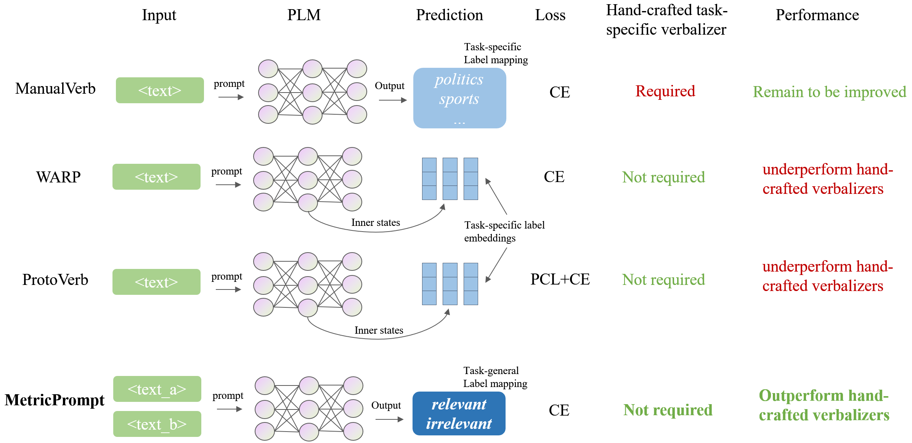
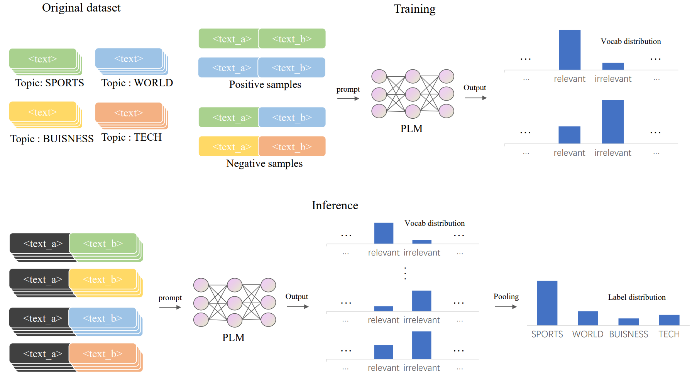

# MetricPrompt
Code and data for KDD 2023 long paper: 

*MetricPrompt: Prompting Model as a Relevance Metric for Few-Shot Text Classification*. Hongyuan Dong, Weinan Zhang, Wanxiang Che
	
If you find this work useful and use it on your own research, please cite our paper.
Our paper is now available on [arXiv](https://arxiv.org/abs/2306.08892), and will soon be published at KDD 2023 conference. 

	
## Overview
Prompting methods have shown impressive performance in a variety of text mining tasks and applications, especially few-shot ones. 
Despite the promising prospects, the performance of prompting model largely depends on the design of prompt template and verbalizer.
In this work, we propose MetricPrompt, which eases verbalizer design difficulty by reformulating few-shot text classification task into text pair relevance estimation task.
MetricPrompt adopts prompting model as the relevance metric, further bridging the gap between Pre-trained Language Model's (PLM) pre-training objective and text classification task, making possible PLM's smooth adaption. 
Taking a training sample and a query one simultaneously, MetricPrompt captures cross-sample relevance information for accurate relevance estimation.
We conduct experiments on three widely used text classification datasets across four few-shot settings.
Results show that MetricPrompt outperforms manual verbalizer and other automatic verbalizer design methods across all few-shot settings, achieving new state-of-the-art (SOTA) performance.
<p align="center">

</p>


## Methods
During training, training samples are paired as positive/negative samples indicating whether the pair of samples are of the same label, and the prompting model is optimized to estimate the relevance. 
The optimized prompting model is then used as a relevance metric to compute query samples’ relevance with each training sample.
These relevance scores are then pooled to produce final classification results. 
The inference stage can be further accelerated by filtering out representative training samples with the prompting model. 
<p align="center">

</p>


## Data 
We ran experiments on 3 text classification datasets under 4 few-shot settings: AG's News, DBPedia and Yahoo Answers Topics. 
Run the following commands to obtain full datasets: 
```
cd ./data
bash download_text_classification.sh
```


## Environment
Our implementation requires `pytorch`, `transformers` and `pathos` package to be installed. 
We list the specific packages used in this project in `requirements.txt`. 
The following commands will help you build a compatible environment: 
```
conda create -n metricprompt python=3.9
conda activate metricprompt
pip install -r requirements.txt
```
If your GPU is based on Ampere architecture, you can install [kernl](https://github.com/ELS-RD/kernl/) package with the following command to accelerate the inference process.
```
pip install 'git+https://github.com/ELS-RD/kernl'
```
After installing kernl, set `--kernl_accerleration 1` in `scripts/metricprompt.sh` to activate the acceleration.


## Quickstart
You can run MetricPrompt simply with `scripts/metricprompt.sh`.
The following commands runs MetricPrompt for AG's News 2-shot setting, where the number of training epochs is set as 120.
```
cd ./scripts
bash metricprompt.sh agnews 2 120
```


## Code
- `main.py` is the entrance of MetricPrompt's training and testing procedure.
- `model.py` contains model definition, as well as the implementation of the optimization and inference process.
- `dataloader.py` contains data processing code. 


